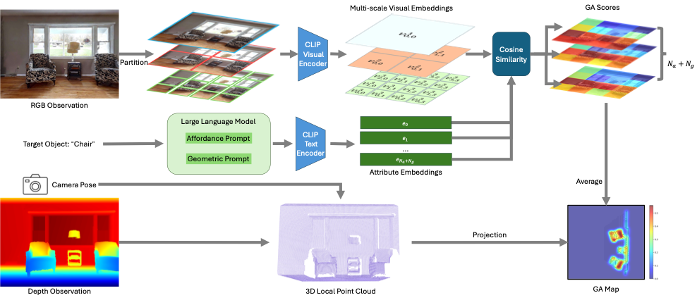

<h2 align="center">
  <b>GAMap: Zero-Shot Object Goal Navigation with Multi-Scale Geometric-Affordance Guidance</b>

  <b><i>Neurips 2024</i></b>
</h2>

This is the official repository of [GAMap: Zero-Shot Object Goal Navigation with Multi-Scale Geometric-Affordance Guidance](https://arxiv.org/abs/2402.10670).

<div align=center>

</div>

## Setup

### Dataset Preparation

Please follow [HM3D](https://aihabitat.org/datasets/hm3d/) to download the dataset and prepare the data. The data format should be:

```
data/
├── objectgoal_hm3d/
│   ├── train/
│   ├── val/
│   └── val_mini/
├── scene_datasets/
│   └── hm3d/
│       ├── minival/
│       └── val/
├── versioned_data/
├── matterport_category_mappings.tsv
└── object_norm_inv_perplexity.npy
```

### Dependencies

1. Python & PyTorch

    This code is tested on Python 3.9.16 on Ubuntu 20.04, with PyTorch 1.11.0+cu113.

2. Habitat-Sim & Habitat-Lab

    ```
    # Habitat-Sim
    git clone https://github.com/facebookresearch/habitat-sim.git
    cd habitat-sim; git checkout tags/challenge-2022; 
    pip install -r requirements.txt; 
    python setup.py install --headless

    # Habitat-Lab
    git clone https://github.com/facebookresearch/habitat-lab.git
    cd habitat-lab; git checkout tags/challenge-2022; 
    pip install -e .
    ```

4. Others

    ```
    pip install -r requirements.txt
    ```

## Running

### Example

An example command to run the pipeline:

```
CUDA_VISIBLE_DEVICES=0 python main.py --split val --eval 1 --auto_gpu_config 0 --prompt_type scoring \
-n 1 --num_eval_episodes 100 --text_threshold 0.55 --boundary_coeff 12 --start_episode 0 --tag_freq 100 \
--use_gtsem 0 --num_local_steps 20 --print_images 1 --exp_name test
```

[//]: # ()
[//]: # (### Visualization)

[//]: # ()
[//]: # (To make a demo video on your saved images, you can either use `ffmpeg` to make separate videos or use)

[//]: # ()
[//]: # (```)

[//]: # (python make_demo.py --exp_name test # add `--delete_img` to delete images after making video)

[//]: # (```)

[//]: # ()
[//]: # (to make batched videos.)

## Acknowledgements

This repo is heavily based on [L3MVN](https://github.com/ybgdgh/L3MVN). We thank the authors for their great work.

## Citation

If you find this work helpful, please consider citing:
